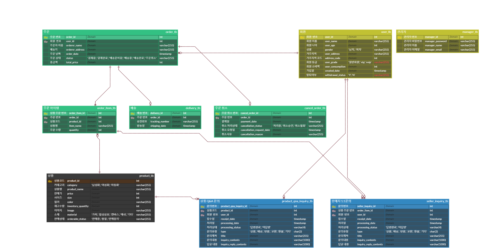
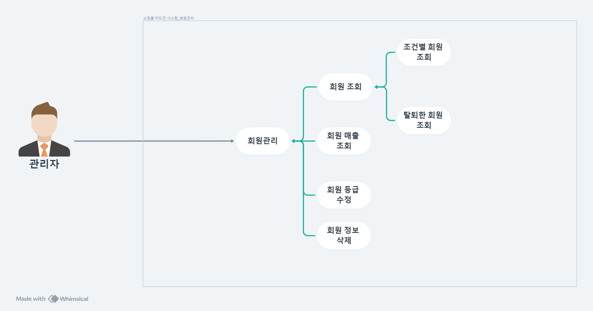
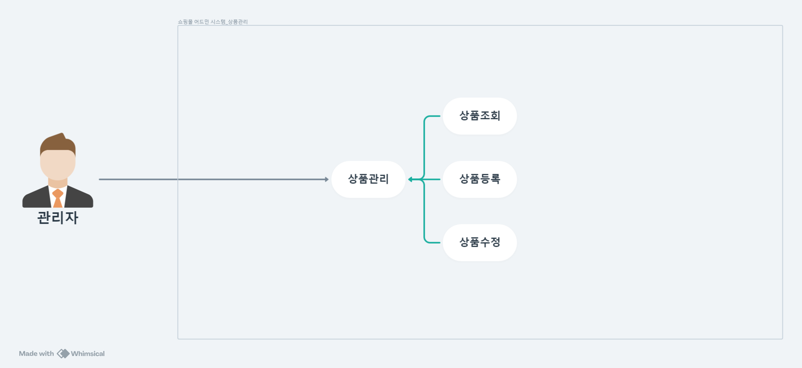
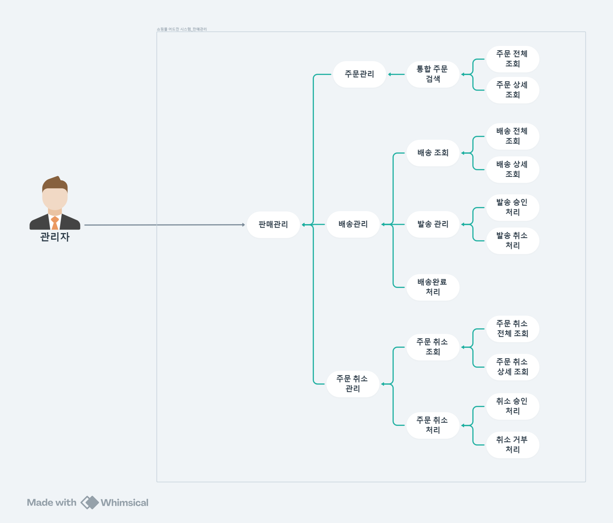
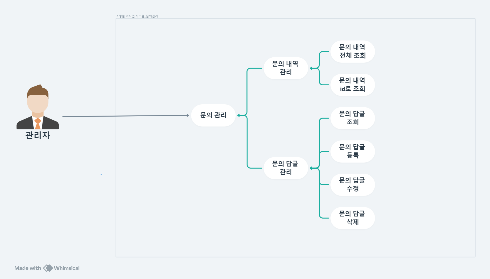
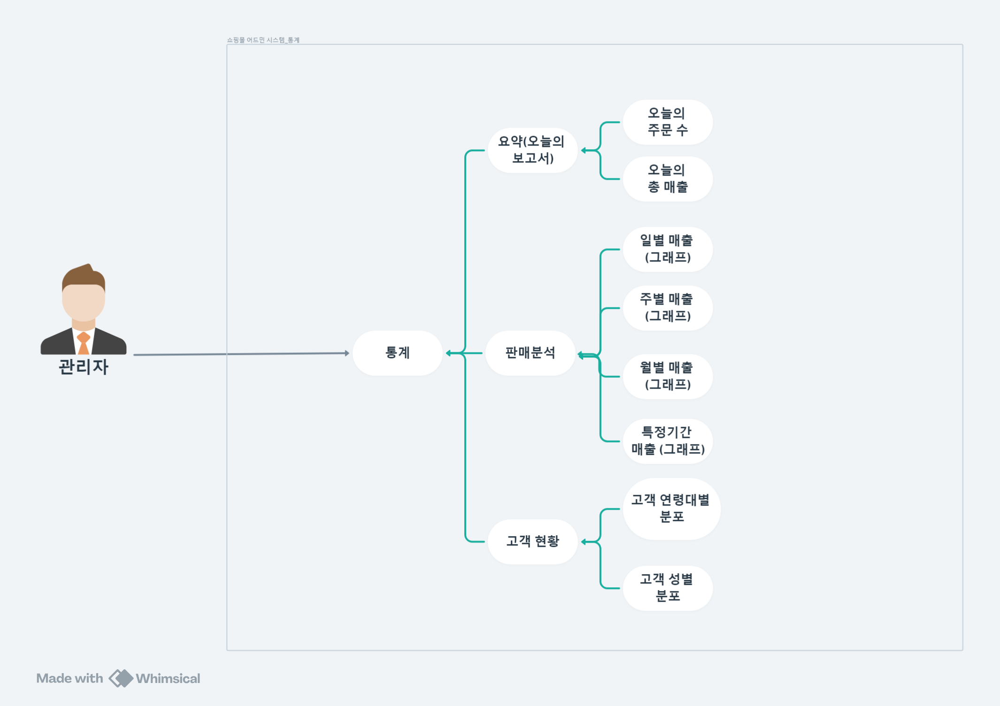
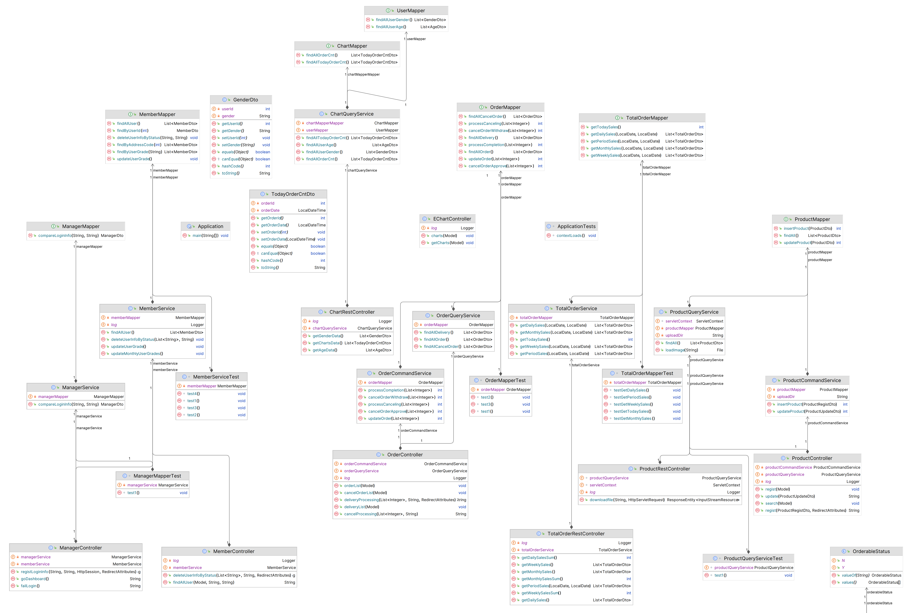
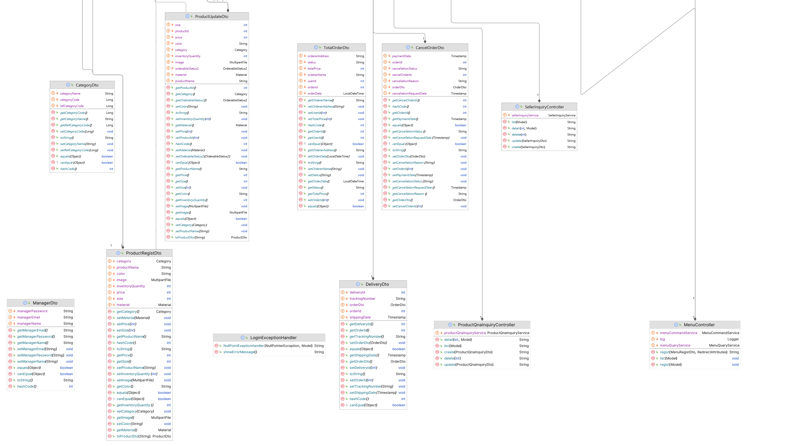

# 👟 Kick-n-Go

## 📄 프로젝트 소개

1. **주제 - Spring Webmvc를 통한 Admin(관리자) 입장에서의 쇼핑몰 web
   프로젝트** : 쇼핑몰 관리자 입장에서 온라인 쇼핑몰의 운영과 관리를 담당하는 관리 시스템입니다.주요 기능은 다음과 같습니다. 1. 상품관리 (상품등록, 조회, 수정) 2. 판매관리 (주문 조회, 취소주문 조회 및 수정, 배송 조회 및 수정) 3. 회원관리 (조회, 등급변경, 삭제) 4. 문의관리 (판매자 1대1 문의, 상품 관련 문의) 5. 통계 (연령별, 성별, 주문수, 기간별 통계)

## 팀원 구성
김도현 박정은 박태준 심재람 이영우 정성연

## Stack

- Programming :  
  
  
  
- Framework :  
- DB :  
- 협업 툴 :     
- ERD 다이어그램 : 

## 프로젝트 구조
### ERD

### 유스케이스 다이어그램
- 회원 관리
  
- 상품 관리
  
- 판매 관리
  
- 문의 관리
  
- 통계
  

### 클래스 다이어그램

## 역할분담
- 김도현 : 리더, 통계 Front/Back단 구현, 문의관리 Front단 구현, 코드 총괄 마무리, 프로젝트 발표
- 박정은 : 상품 관리 Front/Back단 구현
- 박태준 : 로그인 구현, 회원관리 Front/Back 단 구현, 시연영상 제작
- 심재람 : 요구사항 명세 최신화 및 확정, 테이블 정의서 작성
- 이영우 : 판매관리 Front/Back 구현, README 작성
- 정성연 : 통계 Front/Back단 구현, 문의관리 Back 단 구현, 서기, 기획안 작성
- 공통 : 다이어그램(유스케이스, 시퀀스, E-R) 제작, 깃허브 이슈관리, PPT 제작

## 개발기간 및 작업관리
- 개발기간 : 2024-06-14 ~ 2024-06-28
- 작업관리 : 노션 및 깃허브를 이용한 작업관리

## 📌 주요기능

[//]: # (3개 각각 큰 기능들 소개)

#### 👕 상품관리
##### 1️⃣ 상품 등록/수정
- 관리자는 상품을 등록할 수 있습니다.
- 관리자는 상품정보를 수정할 수 있습니다.

##### 2️⃣ 상품 조회
- 관리자는 상품을 전체 조회할 수 있습니다.
- 관리자는 상품을 조건별로 조회할 수 있습니다.
---

#### 📦 판매관리

##### 1️⃣ 주문 조회
- 관리자는 주문내역을 전체 조회할 수 있습니다.
- 관리자는 주문내역을 조건별로 조회할 수 있습니다.

##### 2️⃣ 배송 조회
- 관리자는 배송내역을 전체 조회할 수 있습니다.
- 관리자는 배송내역을 조건별로 조회할 수 있습니다.

##### 3️⃣ 발송 처리/배송 완료 처리
- 관리자는 배송준비가 완료된 주문을 발송 처리 할 수 있습니다.
- 관리자는 배송이 불가능한 주문을 발송 취소 처리 할 수 있습니다.
- 관리자는 배송이 완료된 상품에 대해 배송 완료 처리 할 수 있습니다.

##### 4️⃣ 주문 취소 조회
- 관리자는 주문 취소 내역을 전체 조회할 수 있습니다.
- 관리자는 주문 취소 내역을 조건별로 조회할 수 있습니다.

##### 5️⃣ 주문 취소 승인/거부
- 관리자는 주문 취소 요청건에 대해 취소 승인 처리를 할 수 있습니다.
- 관리자는 주문 취소 요청건에 대해 취소 거부 처리를 할 수 있습니다.
---

#### 🎅 회원관리

##### 1️⃣ 회원 조회
- 관리자는 전체 회원을 조회할 수 있습니다.
- 관리자는 조건별로 회원을 조회할 수 있습니다.

##### 2️⃣ 회원 등급 수정
- 관리자는 회원 소비엑에 따른 회원 등급을 수정할 수 있습니다.
- 회원 등급 수정은 매월 1일에 자동으로 변경된다.

##### 3️⃣ 회원 정보 삭제
- 관리자는 탈퇴 회원 일 경우 회원의 정보를 삭제할 수 있습니다
---

#### ❓ 문의관리

##### 1️⃣ 문의 관리
- 관리자는 등록된 최신순으로 문의 내역 전체 목록을 확인할 수 있습니다.
- 관리자는 조건별로 특정 문의 내역 목록을 조회할 수 있습니다.

##### 2️⃣ 문의 답글 관리
- 관리자는 문의에 대한 답글을 등록할 수 있습니다.
- 관리자는 문의에 대한 답글을 수정할 수 있습니다.
- 관리자는 문의에 대한 답글을 삭제할 수 있습니다.
- 관리자는 문의에 대한 답글을 조회할 수 있습니다.
---

#### 📊 통계

##### 1️⃣ 오늘의 매출 / 오늘의 주문 수
- 관리자는 오늘의 총 매출액을 조회할 수 있습니다.
- 관리자는 오늘 발생한 총 주문 수를 조회할 수 있습니다.

##### 2️⃣ 성별 / 연령별 고객현황
- 관리자는 전체 고객의 성별 분포를 조회할 수 있습니다.
- 관리자는 전체 고객의 연령대별 분포를 조회할 수 있습니다.

##### 3️⃣ 일, 주, 월, 특정기간별 매출(금액)
- 관리자는 특정 기간 내의 일별 매출을 그래프로 조회할 수 있습니다.
- 관리자는 특정 기간 내의 월별 매출을 그래프로 조회할 수 있습니다.
- 관리자는 특정 기간 내의 주별 매출을 그래프로 조회할 수 있습니다.
- 관리자는 특정 기간 내의 일별 매출을 그래프로 조회할 수 있습니다.
---

## 🖋 프로젝트 후기 🖋
### 김도현
- 나이스 너무 고생많으셨습니다!
### 박정은
- 프론트, 웹브라우저를 함께 고려해서 구현하는게 처음이라 어렵게 느껴졌다. 이번 프로젝트를 기반으로 추후 프로젝트에서는 추가 기능을 구현해보고 싶다.
### 박태준
- 뒷단과 앞단을  매핑 하는 것도 굉장히 어렵게 느껴졌고,  아직 모르는게 훨씬 더 많아서 사소한것도 공부하면서 하느라 시간이 많이 부족했던 것 같습니다. 아직 많이 부족하다는 것을 더 많이 느꼈고, 공부해야 할 것도 굉장히 많다는걸 한번 더 느낀 시간이였던 것 같습니다.앞으로 꾸준히 공부하여 계속해서 성장할 수 있도록 노력할것입니다!

### 심재람
- 열심히 하고 싶어도 건강 관리를 제대로 하지 못하면 몸이 따라주지 못해 할 수 없다는 것을 피부에 와닿도록 느끼게 되었던 것 같습니다. 팀 프로젝트는 개인 프로젝트와 달리, 1명이 있다가 없으면 그 빈자리가 되게 크게 느껴져 남은 팀원들이 업무적으로 큰 부담을 갖게 될 수 있었을텐데 잘 마무리해준 팀원들에게 진심으로 감사합니다. 또, 건강 관리도 자기 관리 중에 하나의 영역인데 그 부분을 제대로 하지 못해 팀 활동에서 1인분을 하지 못해  너무 죄송합니다.
### 이영우
- 지금까지 백엔드 구현만 해보다가 처음으로 스프링을 이용해서 프론트엔드까지 연결시켜보는 소중한 경험이었습니다. 아무래도 프론트엔드는 익숙하지 않다보니 구현에 있어 다양한 어려움들이 많았던것 같습니다. 기본적인 CRUD는 열심히 하여 구현하였으나 트랜잭션처리가 필요한 기능들을 완성하지 못하여 아쉬웠습니다. 또한 기본적인 기능의 구현도 완벽하게 끝내지 못한점도 아쉬었던것 같습니다.
  다음 최종 프로젝트에서는 철저하게 준비해서 맡은 이슈를 모두 해결하고자 다짐하였습니다.

### 정성연
- 이번 프로젝트를 진행하면서 여러 가지를 배울 수 있는 값진 시간이었습니다.
  특히, 백엔드 구현에서는 큰 어려움 없이 성공적으로 진행할 수 있었습니다.
  그러나 프론트엔드와 백엔드를 매핑시키는 부분에서 예상보다 많은 어려움을 겪었습니다.
  백엔드에서 데이터를 잘 처리하더라도, 이를 사용자에게 효율적이고 직관적으로 전달하는 것이 쉽지 않았습니다.
  또한, 팀원들과의 협업을 통해 문제를 공유하고 해결해 나가는 과정에서 커뮤니케이션의 중요성도 다시 한 번 깨닫게 되었습니다.
  프로젝트를 마치며, 백엔드 개발에 대한 자신감을 얻은 것뿐만 아니라, 프론트엔드와의 매핑하는 방법에 대해서 더 공부해야겠다는 다짐을 했습니다. 

